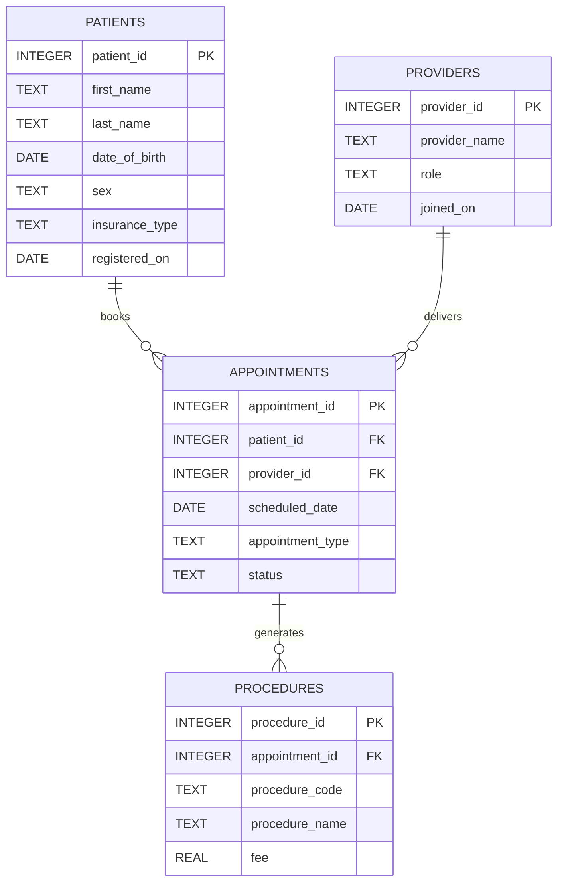
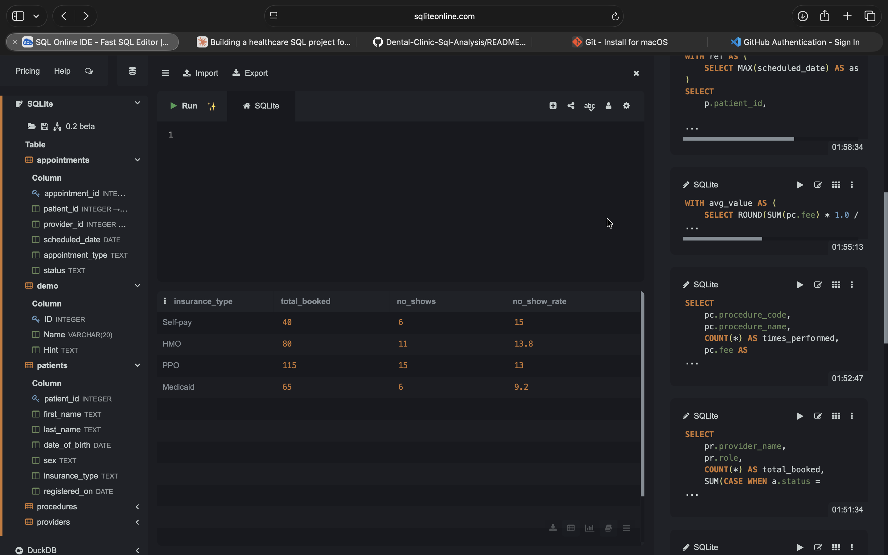
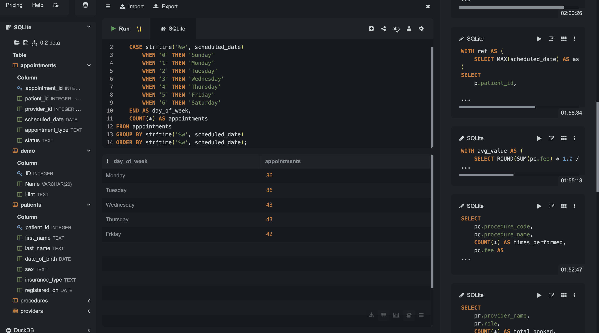
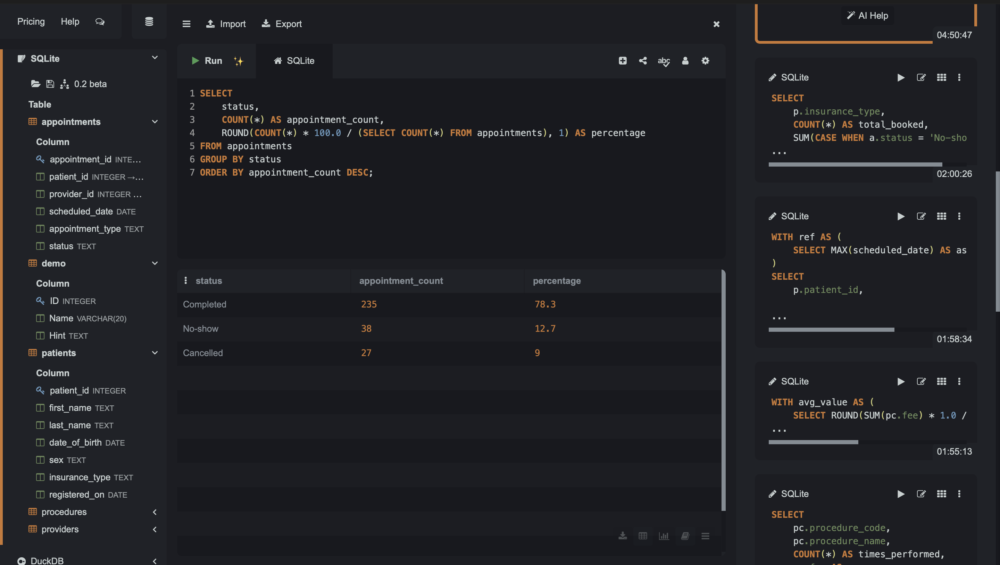
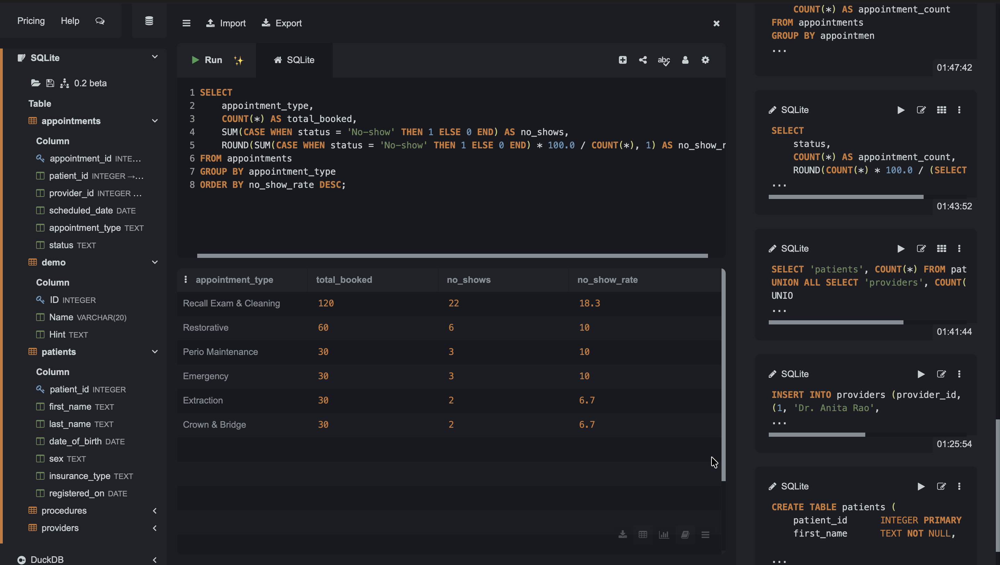
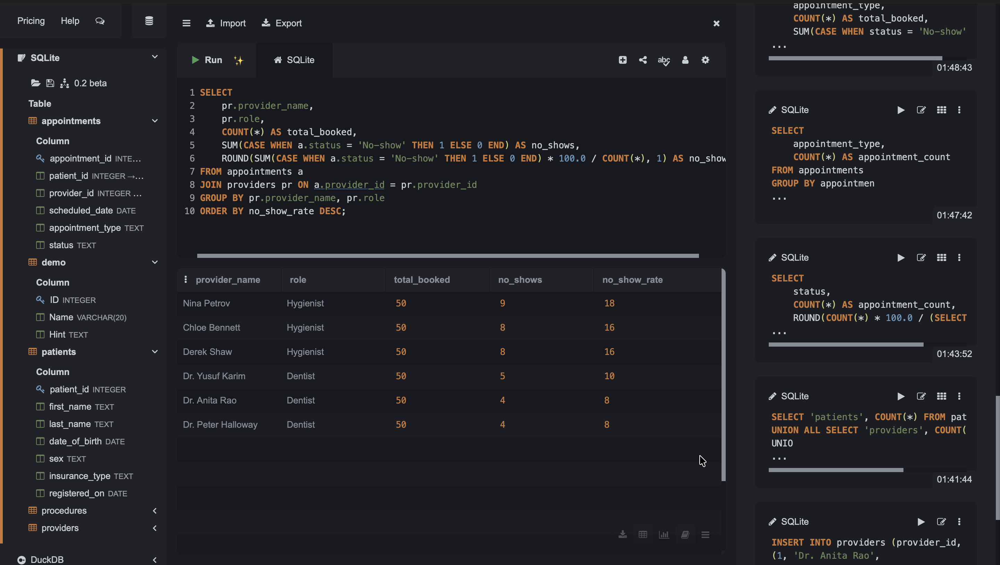
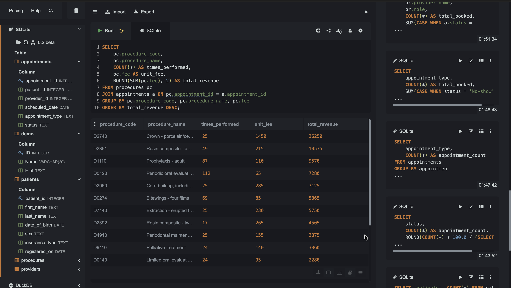
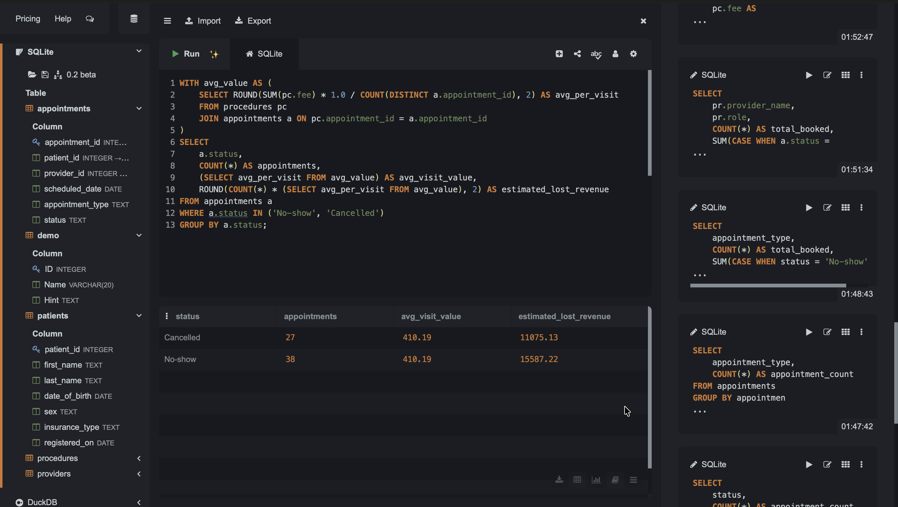
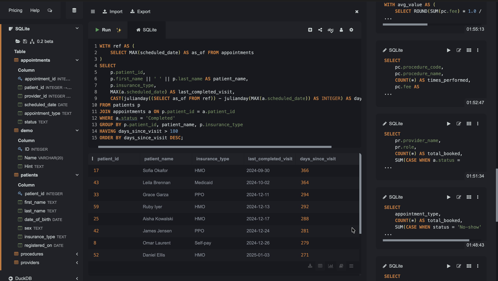
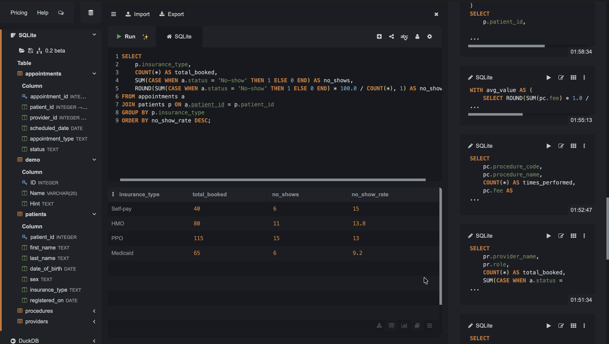

    # Dental Clinic Operations — SQL Database & Analysis

A relational database modelling a small general dental practice, with SQL analysis of appointment attendance, revenue performance, and patient recall compliance.

Designed and built by a BDS dentist now studying Health Informatics. The clinical background shapes which questions are asked and, more importantly, how the results are interpreted.

**Stack:** SQLite · 4 normalised tables · 300 appointments · 8 analysis queries

---

## 1. Problem Statement

Dental practices lose a substantial share of revenue to appointment slots that are booked but never filled. The loss is invisible day to day: a gap in the schedule looks like a quiet afternoon rather than a measurable cost. Most small practices run on practice-management software that records every appointment and procedure, yet rarely surfaces the operational questions that matter:

- How much of our booked chair time is actually used?
- Which kinds of appointments break most often, and why?
- What is a broken appointment worth in dollars?
- Which patients have fallen out of recall and need to be contacted?
- Are apparent differences between providers real, or an artefact of who gets scheduled with whom?

These questions require joining patient, provider, appointment, and treatment data together. A spreadsheet cannot answer them reliably once the data spans multiple related entities.

**This project builds the database that can, and demonstrates the SQL needed to answer each question.**

---

## 2. Solution Overview

| Step | Action | Output |
|---|---|---|
| **1** | Design a normalised schema separating patients, providers, appointments, and procedures | `schema.sql` |
| **2** | Define relationships with primary and foreign keys so invalid records cannot be stored | `schema.sql` |
| **3** | Generate and load realistic clinic data, including weekend-date cleaning | `data.sql` |
| **4** | Write analysis queries, each tied to one operational question | `analysis.sql` |
| **5** | Interpret results against clinical reality and separate signal from noise | This README |
| **6** | Translate findings into actions a practice manager can take | Recommendations below |

---

## 3. Architecture

### Entity relationship diagram



### How the tables connect

`appointments` is the hub. It holds a foreign key to `patients` and another to `providers`, so every visit is tied to exactly one of each. `procedures` hangs off `appointments` — a treatment cannot exist without the visit that delivered it.

This structure is what allows a question like *"revenue per provider"* to be answered even though no single table contains both a provider name and a fee. The query walks the chain:

```
providers → appointments → procedures
```

**One deliberate design decision:** procedures are only created for appointments with `status = 'Completed'`. A no-show produces no treatment and no revenue. This is what makes the lost-revenue analysis meaningful rather than circular.

### Data flow

```
schema.sql          →  creates empty tables with keys and constraints
       ↓
data.sql            →  loads 60 patients, 6 providers, 300 appointments
                       cleans weekend dates with UPDATE
                       derives 482 procedure records from completed visits
       ↓
analysis.sql        →  eight queries, each answering one business question
       ↓
README.md           →  interpretation, limitations, recommendations
```

---

## 4. The Database

| Table | Rows | Contents |
|---|---|---|
| `patients` | 60 | demographics, insurance type, registration date |
| `providers` | 6 | 3 dentists, 3 hygienists |
| `appointments` | 300 | date, type, assigned provider, status |
| `procedures` | 482 | ADA procedure code, description, fee |

Appointments span **January 2024 – October 2025**. A single completed visit can carry several procedure rows: a recall exam typically generates a periodic evaluation, a prophylaxis, and often radiographs. This one-to-many relationship is why `COUNT(DISTINCT appointment_id)` is required when calculating per-visit averages.

### Schema

<details>
<summary>Click to expand <code>schema.sql</code></summary>

```sql
CREATE TABLE patients (
    patient_id      INTEGER PRIMARY KEY,
    first_name      TEXT NOT NULL,
    last_name       TEXT NOT NULL,
    date_of_birth   DATE,
    sex             TEXT,
    insurance_type  TEXT,
    registered_on   DATE
);

CREATE TABLE providers (
    provider_id     INTEGER PRIMARY KEY,
    provider_name   TEXT NOT NULL,
    role            TEXT NOT NULL,
    joined_on       DATE
);

CREATE TABLE appointments (
    appointment_id   INTEGER PRIMARY KEY,
    patient_id       INTEGER NOT NULL,
    provider_id      INTEGER NOT NULL,
    scheduled_date   DATE NOT NULL,
    appointment_type TEXT,
    status           TEXT NOT NULL,
    FOREIGN KEY (patient_id)  REFERENCES patients(patient_id),
    FOREIGN KEY (provider_id) REFERENCES providers(provider_id)
);

CREATE TABLE procedures (
    procedure_id     INTEGER PRIMARY KEY,
    appointment_id   INTEGER NOT NULL,
    procedure_code   TEXT,
    procedure_name   TEXT,
    fee              REAL,
    FOREIGN KEY (appointment_id) REFERENCES appointments(appointment_id)
);
```

</details>



### Data loading and cleaning

Data is generated using recursive sequences rather than hundreds of typed `INSERT` rows. Two `UPDATE` statements then correct a flaw in the generated output:

```sql
UPDATE appointments SET scheduled_date = date(scheduled_date, '+2 days')
WHERE strftime('%w', scheduled_date) = '0';   -- Sundays

UPDATE appointments SET scheduled_date = date(scheduled_date, '+2 days')
WHERE strftime('%w', scheduled_date) = '6';   -- Saturdays
```

Generated dates landed on weekends, which the practice does not schedule. Catching and correcting this before analysis is a routine data-quality step.



---

## 5. Analysis & Findings

### Finding 1 — More than one in five appointments does not happen

**Question:** What proportion of scheduled appointments are completed?

```sql
SELECT
    status,
    COUNT(*) AS appointment_count,
    ROUND(COUNT(*) * 100.0 / (SELECT COUNT(*) FROM appointments), 1) AS percentage
FROM appointments
GROUP BY status
ORDER BY appointment_count DESC;
```

| Status | Count | Share |
|---|---|---|
| Completed | 235 | 78.3% |
| No-show | 38 | 12.7% |
| Cancelled | 27 | 9.0% |

**21.7% of booked chair time goes unused.**



---

### Finding 2 — Recall visits break far more than treatment visits

**Question:** Which appointment types are most likely to break?

```sql
SELECT
    appointment_type,
    COUNT(*) AS total_booked,
    SUM(CASE WHEN status = 'No-show' THEN 1 ELSE 0 END) AS no_shows,
    ROUND(SUM(CASE WHEN status = 'No-show' THEN 1 ELSE 0 END) * 100.0 / COUNT(*), 1) AS no_show_rate
FROM appointments
GROUP BY appointment_type
ORDER BY no_show_rate DESC;
```

| Appointment type | Booked | No-shows | Rate |
|---|---|---|---|
| Recall Exam & Cleaning | 120 | 22 | **18.3%** |
| Restorative | 60 | 6 | 10.0% |
| Perio Maintenance | 30 | 3 | 10.0% |
| Emergency | 30 | 3 | 10.0% |
| Extraction | 30 | 2 | 6.7% |
| Crown & Bridge | 30 | 2 | 6.7% |

Recall is simultaneously the highest-volume and highest-risk category.

**Clinical interpretation:** this gradient tracks perceived urgency, not patient reliability. Recall patients are asymptomatic — nothing hurts and nothing is visibly wrong, so the appointment feels optional. Extraction and crown patients attend because they are in pain or have unfinished work in the mouth.

*Technical note:* `SUM(CASE WHEN ...)` performs conditional counting inside the same `GROUP BY` that counts the total. A `WHERE status = 'No-show'` filter would remove the very rows needed for the denominator.



---

### Finding 3 — The apparent provider difference is case mix, not performance

**Question:** Do no-show rates differ by provider?

```sql
SELECT
    pr.provider_name,
    pr.role,
    COUNT(*) AS total_booked,
    SUM(CASE WHEN a.status = 'No-show' THEN 1 ELSE 0 END) AS no_shows,
    ROUND(SUM(CASE WHEN a.status = 'No-show' THEN 1 ELSE 0 END) * 100.0 / COUNT(*), 1) AS no_show_rate
FROM appointments a
JOIN providers pr ON a.provider_id = pr.provider_id
GROUP BY pr.provider_name, pr.role
ORDER BY no_show_rate DESC;
```

| Provider | Role | Booked | No-shows | Rate |
|---|---|---|---|---|
| Nina Petrov | Hygienist | 50 | 9 | 18.0% |
| Chloe Bennett | Hygienist | 50 | 8 | 16.0% |
| Derek Shaw | Hygienist | 50 | 8 | 16.0% |
| Dr. Yusuf Karim | Dentist | 50 | 5 | 10.0% |
| Dr. Anita Rao | Dentist | 50 | 4 | 8.0% |
| Dr. Peter Halloway | Dentist | 50 | 4 | 8.0% |

Hygienists cluster at 16–18%, dentists at 8–10%. Read in isolation, this looks like a staff performance problem.

**It is not.** Hygienists are scheduled almost entirely with recall and periodontal maintenance visits — precisely the categories Finding 2 identified as highest-risk. The variation is explained by *what sits on the schedule*, not by who delivers the care.

**Treating this table as a provider scorecard would be a misreading of confounded data.** Any fair comparison would need to hold appointment type constant.



---

### Finding 4 — Volume and revenue move in opposite directions

**Question:** Which procedures generate the most revenue?

```sql
SELECT
    pc.procedure_code,
    pc.procedure_name,
    COUNT(*) AS times_performed,
    pc.fee AS unit_fee,
    ROUND(SUM(pc.fee), 2) AS total_revenue
FROM procedures pc
JOIN appointments a ON pc.appointment_id = a.appointment_id
GROUP BY pc.procedure_code, pc.procedure_name, pc.fee
ORDER BY total_revenue DESC;
```

| Code | Procedure | Performed | Unit fee | Revenue |
|---|---|---|---|---|
| D2740 | Crown — porcelain/ceramic | 25 | $1,450 | **$36,250** |
| D2391 | Resin composite — 1 surface | 49 | $215 | $10,535 |
| D1110 | Prophylaxis — adult | 87 | $110 | $9,570 |
| D0120 | Periodic oral evaluation | 112 | $65 | $7,280 |
| D2950 | Core buildup | 25 | $285 | $7,125 |
| D0274 | Bitewings — four films | 69 | $85 | $5,865 |
| D7140 | Extraction — erupted tooth | 25 | $230 | $5,750 |

The most frequently performed procedure (D0120, 112 times) ranks only fourth in revenue. Crowns, performed a quarter as often, generate nearly five times more.

**Clinical interpretation:** this is the expected shape of a general practice. Hygiene consumes substantial chair time at low per-unit value; its contribution is patient retention and case detection rather than direct revenue. A practice that judged the hygiene department on revenue alone would be measuring the wrong thing.



---

### Finding 5 — Broken appointments cost roughly $15,600 per year

**Question:** What is the estimated revenue lost to appointments that never happen?

```sql
WITH avg_value AS (
    SELECT ROUND(SUM(pc.fee) * 1.0 / COUNT(DISTINCT a.appointment_id), 2) AS avg_per_visit
    FROM procedures pc
    JOIN appointments a ON pc.appointment_id = a.appointment_id
)
SELECT
    a.status,
    COUNT(*) AS appointments,
    (SELECT avg_per_visit FROM avg_value) AS avg_visit_value,
    ROUND(COUNT(*) * (SELECT avg_per_visit FROM avg_value), 2) AS estimated_lost_revenue
FROM appointments a
WHERE a.status IN ('No-show', 'Cancelled')
GROUP BY a.status;
```

Average revenue per completed visit: **$410.19**

| Status | Count | Estimated loss |
|---|---|---|
| No-show | 38 | $15,587 |
| Cancelled | 27 | $11,075 |
| **Total** | **65** | **$26,662** |

Across the ~21-month period covered by the data, that is approximately **$15,600 per year**.

*Technical note:* `COUNT(DISTINCT a.appointment_id)` is essential. Because one visit carries multiple procedure rows, a plain `COUNT(*)` would use 482 as the denominator instead of 235, understating visit value by roughly half. This is the most common error made when averaging across a one-to-many join.

*Assumption:* each broken appointment is valued at the average completed-visit revenue. This overstates losses for short recall slots and understates them for restorative work. It estimates scale, not an exact figure.



---

### Finding 6 — A usable recall list, not just a metric

**Question:** Which patients are overdue for recall and should be contacted?

```sql
WITH ref AS (
    SELECT MAX(scheduled_date) AS as_of FROM appointments
)
SELECT
    p.patient_id,
    p.first_name || ' ' || p.last_name AS patient_name,
    p.insurance_type,
    MAX(a.scheduled_date) AS last_completed_visit,
    CAST(julianday((SELECT as_of FROM ref)) - julianday(MAX(a.scheduled_date)) AS INTEGER) AS days_since_visit
FROM patients p
JOIN appointments a ON p.patient_id = a.patient_id
WHERE a.status = 'Completed'
GROUP BY p.patient_id, patient_name, p.insurance_type
HAVING days_since_visit > 180
ORDER BY days_since_visit DESC;
```

This query returns named patients whose last completed visit exceeds 180 days, sorted by how overdue they are. The output — patient ID, name, insurance type, last visit date, days elapsed — is directly usable as a front-desk call list.

**Clinical interpretation:** the 180-day threshold reflects standard six-month dental recall intervals rather than a generic one-year gap. A patient at 366 days has missed two recall cycles.

*Technical notes:*
- `HAVING`, not `WHERE` — the filter applies to `MAX()`, an aggregate, which does not exist until after grouping.
- The reference date is derived from the data (`MAX(scheduled_date)`) rather than hardcoded, so the query stays correct as the dataset grows. An earlier version with a hardcoded date returned zero rows; deriving it fixed the bug and made the query portable.



---

### Finding 7 — No meaningful variation by insurance type

**Question:** Do no-show rates differ by insurance type?

```sql
SELECT
    p.insurance_type,
    COUNT(*) AS total_booked,
    SUM(CASE WHEN a.status = 'No-show' THEN 1 ELSE 0 END) AS no_shows,
    ROUND(SUM(CASE WHEN a.status = 'No-show' THEN 1 ELSE 0 END) * 100.0 / COUNT(*), 1) AS no_show_rate
FROM appointments a
JOIN patients p ON a.patient_id = p.patient_id
GROUP BY p.insurance_type
ORDER BY no_show_rate DESC;
```

| Insurance | Booked | No-shows | Rate |
|---|---|---|---|
| Self-pay | 40 | 6 | 15.0% |
| HMO | 80 | 11 | 13.8% |
| PPO | 115 | 15 | 13.0% |
| Medicaid | 65 | 6 | 9.2% |

**This is reported as a non-finding, deliberately.** The spread is narrow and the counts are small — six no-shows in the smallest group. These differences fall within random variation and should not be presented as a pattern. Notably, Medicaid shows the *lowest* rate, contrary to the common assumption.

Insurance type proxies for income and access to transport. Even a genuine difference would call for improved reminder and transport support, not for treating a patient group as unreliable.



---

## 6. Recommendations

1. **Concentrate reminder effort on recall appointments.** They carry both the highest volume and the highest breakage rate. Spreading reminders uniformly across all appointment types spends effort where it is least needed.
2. **Do not use hygienist no-show rates as a performance measure** without adjusting for appointment type. The difference is structural.
3. **Work the overdue list from Finding 6 directly.** A patient 180+ days without a visit is clinically actionable regardless of revenue implications.
4. **Prioritise high-value slots in short-notice fill procedures.** A broken crown appointment costs several times a broken recall slot.

---

## 7. Limitations

- **The data is synthetic.** It was generated to model realistic clinic operations, with no-show behaviour deliberately weighted toward recall visits. The findings demonstrate schema design, query logic, and interpretation — they are not empirical discoveries about real practices.
- **Fees approximate US private-practice rates** and are fixed per procedure. Real fee schedules vary by insurance contract and geography.
- **Revenue loss is an estimate** based on average visit value, as described in Finding 5.
- **The insurance comparison is underpowered** at these sample sizes and is reported for completeness only.

---

## 8. Repository Contents

| File | Contents |
|---|---|
| `schema.sql` | Four `CREATE TABLE` statements with primary and foreign keys |
| `data.sql` | Data generation, weekend-date cleaning, procedure derivation |
| `analysis.sql` | Eight analysis queries, each annotated with its business question |
| `README.md` | This document |
| `screenshots/` | Query output screenshots |

### Running it yourself

1. Open [sqliteonline.com](https://sqliteonline.com) (no installation) or DB Browser for SQLite
2. Run `schema.sql` to create the tables
3. Run `data.sql` to load the data
4. Run any query from `analysis.sql`

---

## 9. SQL Concepts Demonstrated

Schema design with primary and foreign keys · inner joins across up to three tables · `GROUP BY` with aggregate functions · conditional aggregation via `SUM(CASE WHEN ...)` · `HAVING` versus `WHERE` · common table expressions (CTEs) · correlated subqueries · `COUNT(DISTINCT ...)` to avoid join-inflated denominators · date arithmetic with `julianday()` and `strftime()` · string concatenation · data cleaning with `UPDATE`
